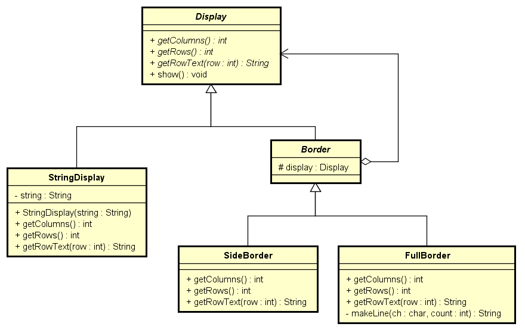

## 1. はじめに

GoFのデザインパターンにおける、**Decoratorパターン**についてまとめます。

## 2. Decoratorパターンとは
- Decoratorという英単語は、**飾り付け(Decorate)するもの**という意味になります。
- Decoratorパターンは、**オブジェクトに対してどんどんデコレーション(飾り付け)を行う方式**です。
- スポンジケーキに対し、クリーム、チョコレート、イチゴ・・・等とデコレーションできるように、オブジェクトも機能を一つ一つ被せてデコレーションしていくイメージになります。
- GoFのデザインパターンでは、**生成に関するデザインパターン**に分類されます。

## 3. サンプルクラス図


## 4. サンプルプログラム
入力した文字列に対して、枠づけ等の装飾を行うプログラムです。

#### 4-1. Displayクラス
文字列表示用の抽象クラスです。

```java:Display.java
public abstract class Display {

	// 横の文字数を得る
	public abstract int getColumns();
	// 縦の行数を得る
	public abstract int getRows();
	// 指定した行の文字列を得る
	public abstract String getRowText(int row);

	public void show() {
		for (int i = 0; i < getRows(); i++) {
			System.out.println(getRowText(i));
		}
	}
}
```

#### 4-2. StringDisplayクラス
1行だけからなる文字列表示用のクラスです。

```java:StringDisplay.java
public class StringDisplay extends Display {

	private String string;

	public StringDisplay(String string) {
		this.string = string;
	}

	public int getColumns() {

		return string.getBytes().length;
	}

	public int getRows() {
		return 1;
	}

	public String getRowText(int row) {
		return (row == 0) ? string : null;
	}
}
```

#### 4-3. Borderクラス
飾り枠を表す抽象クラスです。

```java:Border.java
public abstract class Border extends Display {

	protected Display display;

	protected Border(Display display) {
		this.display = display;
	}
}
```

#### 4-4. SideBorderクラス
左右に飾り枠をつけるクラスです。

```java:SideBorder.java
public class SideBorder extends Border {

	public SideBorder(Display display) {
		super(display);
	}

	public int getColumns() {
		// 文字数は中身の両側に飾り文字分を加えた数
		return 1 + display.getColumns() + 1;
	}

	public int getRows() {
		// 行数は中身の行数に同じ
		return display.getRows();
	}

	public String getRowText(int row) {
		return "*" + display.getRowText(row) + "*";
	}
}
```

#### 4-5. FullBorderクラス
上下左右に飾り枠をつけるクラスです。

```java:FullBorder.java
public class FullBorder extends Border {

	public FullBorder(Display display) {
		super(display);
	}

	public int getColumns() {
		// 文字数は中身の両側に左右の飾り文字分を加えた数
		return 1 + display.getColumns() + 1;
	}

	public int getRows() {
		// 行数は中身の行数に上下の飾り文字分を加えた数
		return 1 + display.getRows() + 1;
	}

	public String getRowText(int row) {
		if (row == 0) {
			// 上端の枠
			return "+" + makeLine('-', display.getColumns()) + "+";
		} else if (row == display.getRows() + 1) {
			// 下端の枠
			return "+" + makeLine('-', display.getColumns()) + "+";
		} else {
			// それ以外
			return "|" + display.getRowText(row - 1) + "|";
		}
	}

	private String makeLine(char ch, int count) {
		StringBuffer buf = new StringBuffer();
		for (int i = 0; i < count; i++) {
			buf.append(ch);
		}
		return buf.toString();
	}
}
```

#### 4-6. Mainクラス
メイン処理を行うクラスです。

```java:Main.java
public class Main {

	public static void main(String[] args) {
		Display b1 = new StringDisplay("Hello world");
		b1.show();
		System.out.println("");

		Display b2 = new SideBorder(b1);
		b2.show();
		System.out.println("");

		Display b3 = new FullBorder(b2);
		b3.show();
		System.out.println("");

		Display b4 =
			new FullBorder(
				new SideBorder(
					new FullBorder(
						new StringDisplay("Hello japan"))));
		b4.show();
	}
}
```

#### 4-7. 実行結果
```
Hello world

*Hello world*

+-------------+
|*Hello world*|
+-------------+

+---------------+
|*+-----------+*|
|*|Hello japan|*|
|*+-----------+*|
+---------------+
```

## 5. メリット
Decoratorパターンでは、飾り枠(Border)も中身(StringDisplay)も共通のインターフェースを持っています。インターフェースは共通ですが、包めば包むほど機能が追加されていきます。その際に、包まれる方を修正する必要はありません。包まれるものを変更することなく、機能の追加を行うことができます。

## 6. GitHub
- https://github.com/i-tanaka730/design_pattern

## 7. デザインパターン一覧
- [**GoFのデザインパターンまとめ**](https://github.com/i-tanaka730/design_pattern/blob/master/docs/GoFのデザインパターンまとめ.md)

## 8. 参考
今回の記事、及びサンプルプログラムは、以下の書籍を元に作成させて頂きました。

- [**Java言語で学ぶデザインパターン入門**](
https://www.amazon.co.jp/%E5%A2%97%E8%A3%9C%E6%94%B9%E8%A8%82%E7%89%88Java%E8%A8%80%E8%AA%9E%E3%81%A7%E5%AD%A6%E3%81%B6%E3%83%87%E3%82%B6%E3%82%A4%E3%83%B3%E3%83%91%E3%82%BF%E3%83%BC%E3%83%B3%E5%85%A5%E9%96%80-%E7%B5%90%E5%9F%8E-%E6%B5%A9/dp/4797327030/ref=sr_1_1?ie=UTF8&qid=1549628781)

大変分かりやすく、勉強になりました。感謝申し上げます。
デザインパターンやサンプルプログラムについての説明が詳細に書かれていますので、是非書籍の方もご覧ください。
