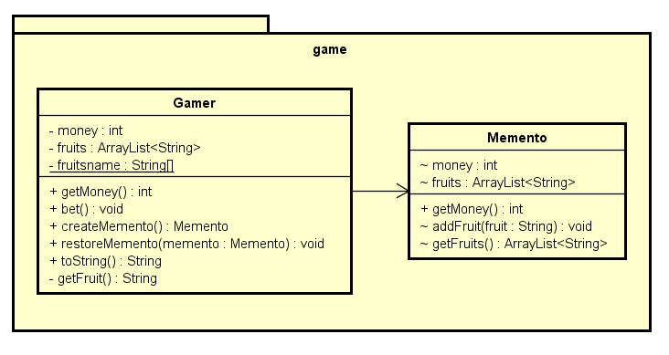

## 1. はじめに

GoFのデザインパターンにおける、**Mementoパターン**についてまとめます。

## 2. Mementoパターンとは
- Mementoという英単語は、**記念品**、**形見**、**思い出の種**という意味になります。
- オブジェクト指向のプログラムでアンドゥを行うには、インスタンスの持っている情報を保存しておく必要があります。
- インスタンスを復元するためには、インスタンス内部の情報に自由にアクセスできる必要があります。しかし、不用意にアクセスを許してしまうと、そのクラスの内部構造に依存したコードになってしまいます。これを**カプセル化の破壊**といいます。
- Mementoパターンは、**インスタンスの状態を表す役割を導入して、カプセル化の破壊に陥ることなく保存/復元を行う方式です。**
- GoFのデザインパターンでは、**振る舞いに関するデザインパターン**に分類されます。

## 3. サンプルクラス図


## 4. サンプルプログラム
振ったサイコロの目に応じて、所持金や持ち物(フルーツ)を変化させるプログラムです。
状況に応じて、保存やアンドゥを行います。

#### 4-1. Gamerクラス
Gameを行う主人公のクラスです。Mementoのインスタンスを作成します。

```java:Gamer.java
package game;

import java.util.ArrayList;
import java.util.Iterator;
import java.util.Random;

public class Gamer {

	private int money;
	private ArrayList<String> fruits = new ArrayList<String>();
	private Random random = new Random();
	private static String[] fruitsname = {
			"リンゴ", "ぶどう", "バナナ", "みかん",
	};

	public Gamer(int money) {
		this.money = money;
	}

	public int getMoney() {
		return money;
	}

	 // 賭ける…ゲームの進行
	public void bet() {
		// サイコロを振る
		int dice = random.nextInt(6) + 1;

		if (dice == 1) {
			// 1の目…所持金が増える
			money += 100;
			System.out.println("所持金が増えました。");
		} else if (dice == 2) {
			// 2の目…所持金が半分になる
			money /= 2;
			System.out.println("所持金が半分になりました。");
		} else if (dice == 6) {
			// 6の目…フルーツをもらう
			String f = getFruit();
			System.out.println("フルーツ(" + f + ")をもらいました。");
			fruits.add(f);
		} else {
			// それ以外…何も起きない
			System.out.println("何も起こりませんでした。");
		}
	}

	// スナップショットをとる
	public Memento createMemento() {
		Memento m = new Memento(money);
		Iterator it = fruits.iterator();
		while (it.hasNext()) {
			String f = (String) it.next();
			if (f.startsWith("おいしい")) {
				// フルーツはおいしいものだけ保存
				m.addFruit(f);
			}
		}
		return m;
	}

	// アンドゥを行う
	public void restoreMemento(Memento memento) {
		this.money = memento.money;
		this.fruits = memento.getFruits();
	}

	public String toString() {
		return "[money = " + money + ", fruits = " + fruits + "]";
	}

	private String getFruit() {
		String prefix = "";
		if (random.nextBoolean()) {
			prefix = "おいしい";
		}
		return prefix + fruitsname[random.nextInt(fruitsname.length)];
	}
}
```

#### 4-2. Mementoクラス
Gemeの状態を表すクラスです。

```java:Memento.java
package game;

import java.util.ArrayList;

public class Memento {

	int money;
	ArrayList<String> fruits;

	public int getMoney() {
		return money;
	}

	Memento(int money) {
		this.money = money;
		this.fruits = new ArrayList<String>();
	}

	void addFruit(String fruit) {
		fruits.add(fruit);
	}

	ArrayList<String> getFruits() {
		return (ArrayList<String>) fruits.clone();
	}
}
```

#### 4-3. Mainクラス
メイン処理を行うクラスです。ゲームを進行させます。また、Mementoのインスタンスを保存しておき、必要に応じてGamerの状態を復元します。

```java:Main.java
import game.Gamer;
import game.Memento;

public class Main {

	public static void main(String[] args) {
		// 最初の所持金は100
		Gamer gamer = new Gamer(100);
		// 最初の状態を保存しておく
		Memento memento = gamer.createMemento();

		for (int i = 0; i < 10; i++) {
			System.out.println("==== " + i);
			System.out.println("現状:" + gamer);

			// ゲームを進める
			gamer.bet();

			System.out.println("所持金は" + gamer.getMoney() + "円になりました。");

			if (gamer.getMoney() > memento.getMoney()) {
				System.out.println("    （だいぶ増えたので、現在の状態を保存しておこう）");
				memento = gamer.createMemento();
			} else if (gamer.getMoney() < memento.getMoney() / 2) {
				System.out.println("    （だいぶ減ったので、以前の状態に復帰しよう）");
				gamer.restoreMemento(memento);
			}
		}
	}
}
```

#### 4-4. 実行結果
```
==== 0
現状:[money = 100, fruits = []]
フルーツ(おいしいバナナ)をもらいました。
所持金は100円になりました。
==== 1
現状:[money = 100, fruits = [おいしいバナナ]]
所持金が増えました。
所持金は200円になりました。
    （だいぶ増えたので、現在の状態を保存しておこう）
==== 2
現状:[money = 200, fruits = [おいしいバナナ]]
何も起こりませんでした。
所持金は200円になりました。
==== 3
現状:[money = 200, fruits = [おいしいバナナ]]
所持金が増えました。
所持金は300円になりました。
    （だいぶ増えたので、現在の状態を保存しておこう）
==== 4
現状:[money = 300, fruits = [おいしいバナナ]]
何も起こりませんでした。
所持金は300円になりました。
==== 5
現状:[money = 300, fruits = [おいしいバナナ]]
所持金が半分になりました。
所持金は150円になりました。
==== 6
現状:[money = 150, fruits = [おいしいバナナ]]
何も起こりませんでした。
所持金は150円になりました。
==== 7
現状:[money = 150, fruits = [おいしいバナナ]]
所持金が増えました。
所持金は250円になりました。
==== 8
現状:[money = 250, fruits = [おいしいバナナ]]
所持金が半分になりました。
所持金は125円になりました。
    （だいぶ減ったので、以前の状態に復帰しよう）
==== 9
現状:[money = 300, fruits = [おいしいバナナ]]
何も起こりませんでした。
所持金は300円になりました。
```

## 5. メリット
Mementoパターンを使うと、**アンドゥ、リドゥ、作業履歴の作成、現在状態の保存**といったことを行うことができます。
アンドゥをやりたかったら、Gamerクラスにその機能を作りこめばいいじゃないかという疑問も出てくるかと思います。
Mainクラスでは、「どのタイミングでスナップショットを撮るか」「いつアンドゥするか」を決め、Memento役を保持するという仕事を行います。
一方、Gamerクラスでは、Memento役を作る仕事と、与えられたMemento役を使って自分の状態を戻す仕事を行います。
MainクラスとGamerクラスでは、このように役割分担を行っていることが分かります。このような役割分担をしておけば、

- 複数ステップのアンドゥを行うように変更したい
- アンドゥだけでなく、現在の状態をファイルに保存したい

という修正を行いたいときにも、Gamer役を変更する必要はなくなります。

## 6. GitHub
- https://github.com/i-tanaka730/design_pattern

## 7. デザインパターン一覧
- [**GoFのデザインパターンまとめ**](https://github.com/i-tanaka730/design_pattern/blob/master/docs/GoFのデザインパターンまとめ.md)

## 8. 参考
今回の記事、及びサンプルプログラムは、以下の書籍を元に作成させて頂きました。

- [**Java言語で学ぶデザインパターン入門**](
https://www.amazon.co.jp/%E5%A2%97%E8%A3%9C%E6%94%B9%E8%A8%82%E7%89%88Java%E8%A8%80%E8%AA%9E%E3%81%A7%E5%AD%A6%E3%81%B6%E3%83%87%E3%82%B6%E3%82%A4%E3%83%B3%E3%83%91%E3%82%BF%E3%83%BC%E3%83%B3%E5%85%A5%E9%96%80-%E7%B5%90%E5%9F%8E-%E6%B5%A9/dp/4797327030/ref=sr_1_1?ie=UTF8&qid=1549628781)

大変分かりやすく、勉強になりました。感謝申し上げます。
デザインパターンやサンプルプログラムについての説明が詳細に書かれていますので、是非書籍の方もご覧ください。
